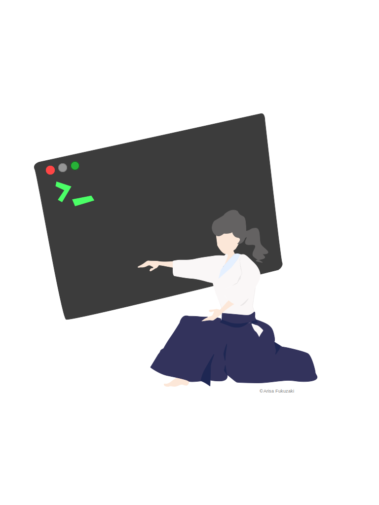
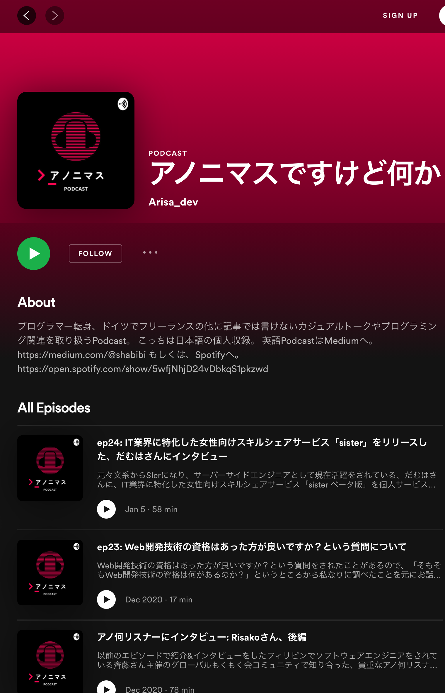
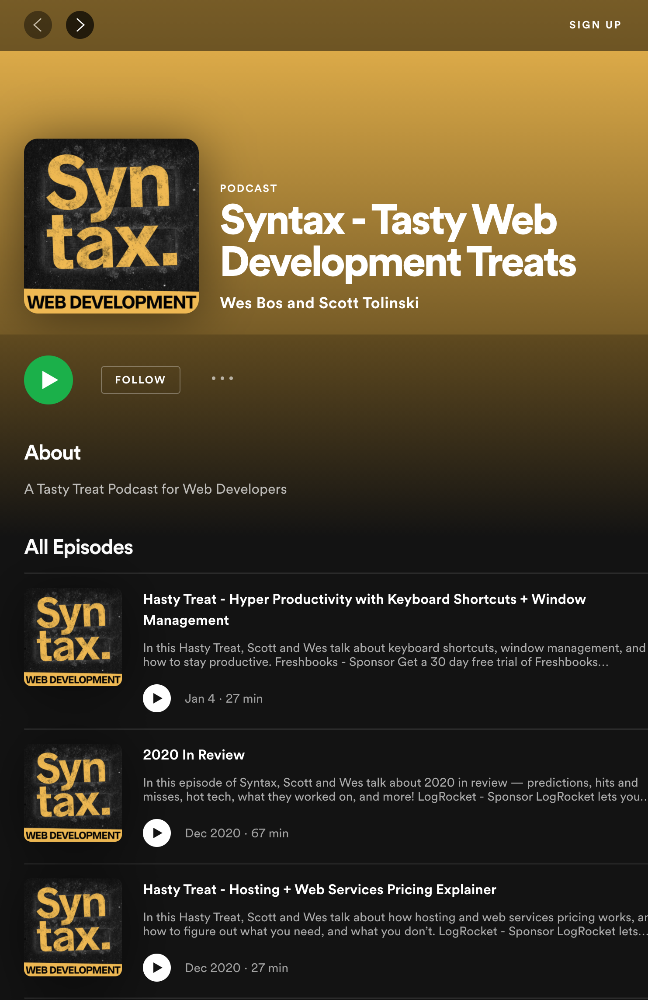

```
$ whoami
```

**Arisa Fukuzaki**

---

### Who Am I?

```javascript
---
name: "Arisa Fukuzaki"
job: "フリーランス フルスタックエンジニア"
project: "個人サービス、Lilac(ライレック)開発&運営&講師"
before: "元エミレーツ航空CA"
---

* エンジニア歴約4年
* React😍
* Gatsby😍
* Podcast「アノニマスですけど何か」🎙
```

---


### 開発中の個人サービス

「オーダーメイド感覚
プログラミング学習サービス」
[Lilac（ライレック）](https://note.com/frontendlifeinde/m/m9b8feda1d547)

---


### CA→エンジニア転職した経験


---
### きっかけは2つ


---


### きっかけ1

- 肉体的、精神的消耗が激しい仕事
- 1年未満で続けられなくなる人が多い

---


### きっかけ2

海外企業の転職活動開始💪
→ 関連ある学位がない
→ CAの経験しかない

👇

書類選考落ちの連続😱

---


「エンジニアは、
需要が高くていいぞ💡」
という情報を見つけた

---


「文系出身だけど、
やってみないとわからない💪」

---


「何これ、
プログラミングめちゃ楽しい😍」

---


- 2ヶ月半オンラインスクールへ
- スクール受講中: 個人で受託
- そのままフリーランスに

---


### 転職した際の勉強方法や独学

---


### 方法は3つ

---


### 方法1

プログラミングが好きかどうか
チェック
「まずやってみる」

---


### 方法2

オンラインプログラミングスクールに2ヶ月半通った

---

### 方法3


- 知人やクラウドソーシングから
個人受託
- 実務と個人プロジェクトで新スキル習得

---


### 海外生活や、海外フリーランスをしている様子

---


### 海外フリーランスや生活する上でのメリット、デメリット

---


### 生活メリット4つ🙆‍♀️

---


1. 個人主義🍵
2. 女性の権利が比較的守られている🦺
3. 長期休暇情熱が熱いドイツ🏖
4. 生活費安い👛

---


### 生活デメリット4つ👎

---


1. **英語通じない & ドイツ語必須😱**
2. **友達作り難しい😢**
3. 地方オフライン技術系コミュニティは言葉の壁😱
4. IT企業やスタートアップは都市部に集中☠️

👌 3と4はリモートワークで解消

---


### 海外フリーランスメリット3つ🙆‍♀️

---


1. 自分らしくいられる国や場所で仕事できる
2. 自分で休暇の管理ができる
3. 仕事しながら、電車でいろんな国に行ける

---


### 海外フリーランスデメリット3つ👎

---


1. 世界情勢で、好きな時に帰国できない
2. 親が急病や高齢化したとき、すぐ駆け付けられない
3. 日本のオフライン技術イベントに、ほぼ行けない

---


### プログラミングメンター講師の経験について

---


- フロントエンド開発メンター　3年
- メンターになるまでのフェーズ　4つ

---


### Phase 1
### 講師になりたいと思ったきっかけ

---


- 2017年当時、海外フリーランスエンジニアの情報がほとんどなくて困った
- 学習中に出会ったメンターの先生に憧れた

---


### Phase 2

### メンター始めたきっかけ

---


- 半年経験を積んで、個人サービス開発者と出会った
- そのCtoC型オンラインスクールで、運営、教材作成、メンターをした

---


### Phase 3

### Lilacを作って教えることになったきっかけ

---


- 前教えていた所がサービス終了
→ 受講生が一定数いて、本業で回せる感じだった
→ 個人で教え続けた
→ どうせなら整えて、個人サービスにしよう💪

---


### Phase 4

### メンターとしての実績

---


- マンツーマンで教えてきた受講生、**40名以上**
- 約10名、日本やドイツ企業に就職/フリーランス独立🎉

QAエンジニア、UXコーダー、フロントエンドエンジニア etc...

---


### Podcast「アノ何」発信コンテンツと、きっかけ

---



#### 「アノニマスですけど何か」
- 海外
- フリーランス
- ワークライフバランス
- プログラミング etc...

---


**だむはさん出演エピソード🎉**

[https://anchor.fm/arisa-dev/episodes/ep24-ITsister-eoj2in](https://anchor.fm/arisa-dev/episodes/ep24-ITsister-eoj2in)

---


### アノ何を始めたきっかけ

---



- [Syntax](https://open.spotify.com/show/4kYCRYJ3yK5DQbP5tbfZby?si=bOe7-kl6RnOHapMsVnFWgw)という技術系Podcastに憧れた
- Syntaxは、ギークな内容多い

→ 私が真似てもニーズなし❌

---


### 私のブログ訪問者の層

- プログラミング学習者👨‍💻
- 海外フリーランスエンジニアを目指す人✈️
- ヨーロッパ/ドイツ移住を目指す人🇪🇺
- 女性👩

---


技術の話でもギークすぎない内容👍

---


### 女性がIT業界で働くことについて

---


### 文系不向き説について

---


- 私は文系リベラルアーツ出身📗
- 文系でもエンジニアになれた🙆‍♀️
- プログラミング = 数学、計算 ばかりではない💡
- プログラミング言語と、語学は似ている🗣

---


### 女性がIT業界で働くことについて

---


- もっと増えてほしい🙆‍♀️
- 技術があれば復帰しやすい👍
- 出産後も復帰しやすいと聞く👂
- 女性が女性を技術で救う時代は素敵✨

---


### 女性にとってエンジニアはおすすめ?

---


# オススメ👍👍👍

---


### 理由4つ

---


### 1. 性別による優劣が問われない職業

---


### 2. 出産後、復帰できないと言う女性エンジニアが少ない

---


### 3. 女性が過ごしやすい場所や国を選べる

---


### 4. フルリモートなど、ハラスメントを受けにくい環境を選ぶことも可能

---


### Thank you🎉

Twitter: [@arisa_dev](https://twitter.com/arisa_dev)
Blog: [https://aiki-developer.com](https://aiki-developer.com)
