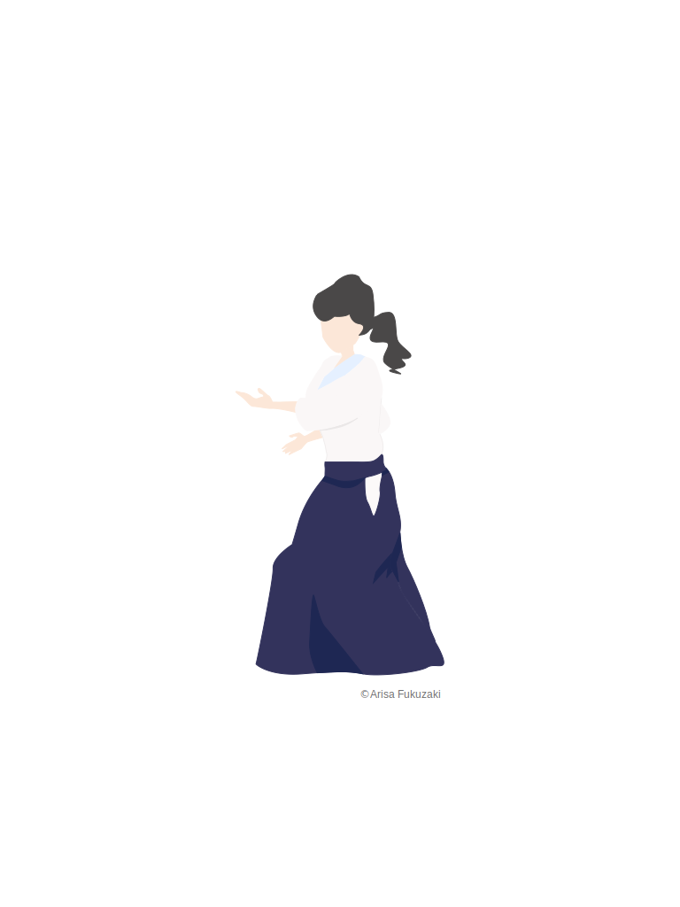
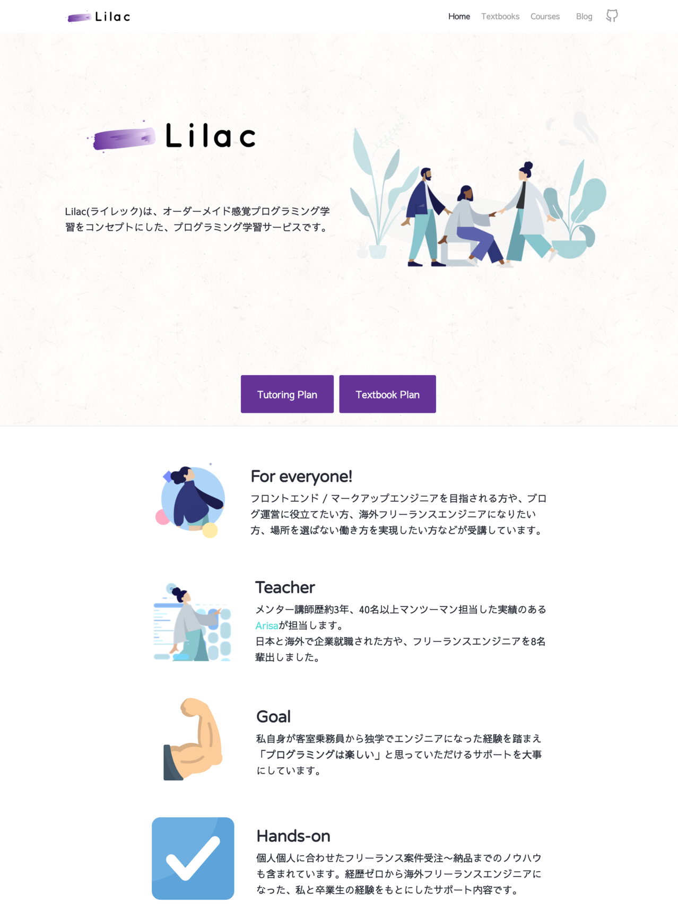
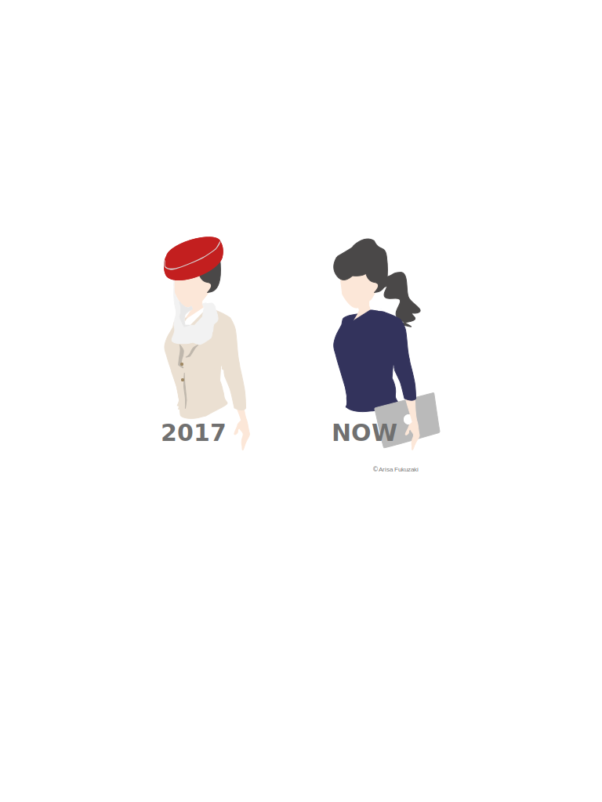
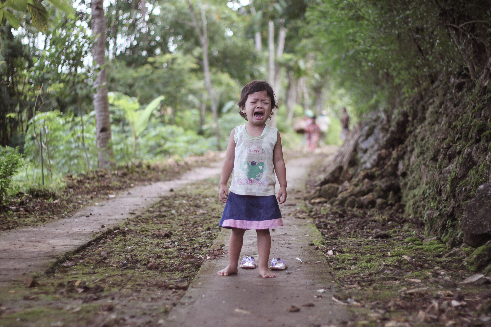
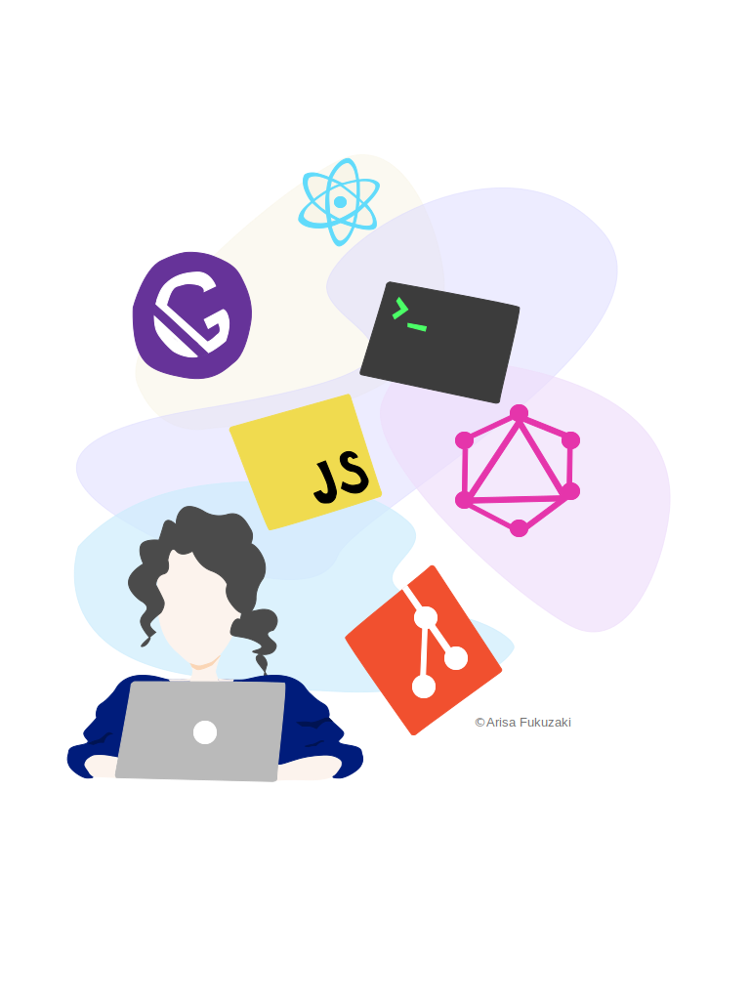
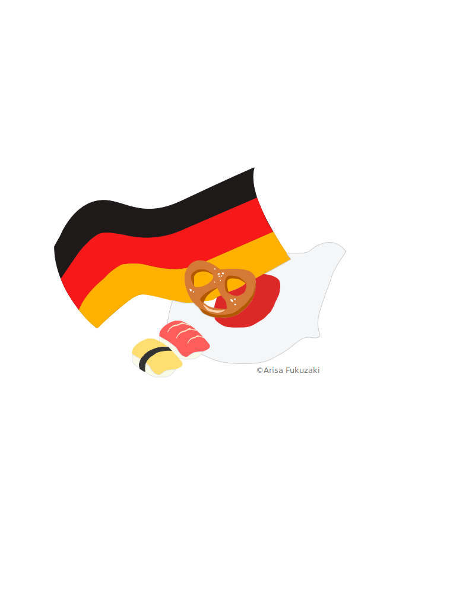

```
$ whoami
```

**Arisa Fukuzaki**

---

# Who Am I?

```javascript
---
name: "Arisa Fukuzaki"
job: "フリーランス フルスタックエンジニア"
project: "個人サービス、Lilac(ライレック)開発&運営&講師"
before: "元エミレーツ航空CA"
---

* エンジニア歴約4年
* React😍
* Gatsby😍
* Podcast「アノニマスですけど何か」🎙
```

---



### 開発中の個人サービス

「オーダーメイド感覚
プログラミング学習サービス」
Lilac（ライレック）

---


### CA→エンジニア転職した経験



---
### きっかけは2つ


---


### きっかけ1

- 肉体的、精神的消耗が激しい仕事
- 1年未満で続けられなくなる人が多い

---



### きっかけ2

海外企業の転職活動開始💪
→ 関連ある学位がない
→ CAの経験しかない

👇

書類選考落ちの連続😱

---


「エンジニアは、
需要が高くていいぞ💡」
という情報を見つけた

---


「文系出身だけど、
やってみないとわからない💪」

---


「何これ、
プログラミングめちゃ楽しい😍」

---


- 2ヶ月半オンラインスクールへ
- スクール受講中: 個人で受託
- そのままフリーランスに

---




### 転職した際の勉強方法や独学

---


### 方法は3つ

---


### 方法1

プログラミングが好きかどうか
チェック
「まずやってみる」

---


### 方法2

オンラインプログラミングスクールに2ヶ月半通った

---

### 方法3


- 知人やクラウドソーシングから
個人受託
- 実務と個人プロジェクトで新スキル習得

---




### 海外生活や、海外フリーランスをしている様子

---


### 海外フリーランスや生活する上でのメリット、デメリット

---


### 生活メリット4つ🙆‍♀️

---


1. 個人主義🍵
2. 女性の権利が比較的守られている🦺
3. 長期休暇情熱が熱いドイツ🏖
4. 生活費安い👛

---


### 生活デメリット4つ👎

---


1. **英語通じない & ドイツ語必須😱**
2. **友達作り難しい😢**
3. 地方オフライン技術系コミュニティは言葉の壁😱
4. IT企業やスタートアップは都市部に集中☠️

👌 3と4はリモートワークで解消

---


### 海外フリーランスメリット3つ🙆‍♀️
